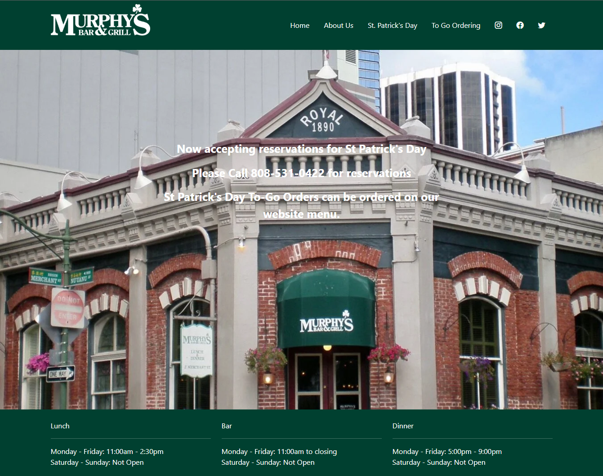

*The UI Experience as an Artist*

## Learning a UI Framework for the First Time

In my opinion, learning a UI Framework is similar to my first time learning Java. The hard part isn't the syntax or actually figuring out the code to solve a problem, it is trying to remember every built in function and how to apply them. Every time I want to achieve a certain output I would have a vague idea of what prototype function to use, but I would have to look it up anyways since I couldn't remember how to apply it or what exactly it did. In the end, nine time out of time I would still apply it wrong several times before finally getting it correct. That is how I feel about UI Frameworks as of currently. Yes, this issue will probably be solved with more experience. Do I have this experience yet, no. Will I gain this experience years down the line, maybe.

## HTML and CSS: Literal Sticks and Stones

To talk about UI Frameworks I would first like to briefly discuss HTML and CSS, the back bone of web design. While HTML handles the actual contents of the page, CSS allows for further freedom with styling. It is important to note that for most simple websites (those that mainly stick to a landing page with other side pages and a nav bar) can almost solely rely on just HTML and CSS. HTML offers a few interactive elements such as links and buttons, and CSS can clean up the appearance to make the website feel professional. 

## Bootstrap 5

So, why would anyone use a UI framework like Bootstrap 5 if you can achieve similar results with just raw HTML and CSS? The answer is similar to a phrase I live my life by: "why use big word if little word does the same thing." Getting a navbar setup with HTML and CSS is doable and quite easy. However, it is going to take a few more lines than you would expect and it might turn into a mess to read by the end of it. UI frameworks like Bootstrap 5 solve this issue by making the navbar a class that automatically formats one. It takes less time, looks cleaner, and still offers the ability to modify the navbar completely like it was raw CSS. I would also argue that UI frameworks help with consistency. 

Above is a image from the landing page of the first ever website I made. The code base is made entirely of HTML and CSS with very minor amounts of Java script. Does the page look bad? I wouldn't say so for my first ever attempt, but it is very basic and suffers from an inconsistency with margins. A main issue I had during this time was getting the margins on the web page to stay consistently uniform when scaling for different view ports. Normally with just HTML, you could add a media tag to cover specific cases, but it is hard to cover every single case. With Bootstrap 5, implementing this is quite simple. Responsive breakpoints (sm is greater than or equal to 576px, md is greater than or equal to 768px, and lg is greater than or equal to 992px) allows a webpage to be modified for different view ports while still maintaining a similar formatt.

 

As an example, the two images above are from a recent exercise where I had to recreate a website using Bootstrap 5. The image on the left shows the web page when the view port is above 992px. However, when the view port shrinks the items in the nav bar get tucked away under a clickable menu button.

## Why UI Frameworks

Although it may seem like a lot of work at first, UI frameworks offer a quicker, cleaner, and more streamlined way of creating web pages. While, also allowing for creators to implement more complex formatting and interactivity for users.
