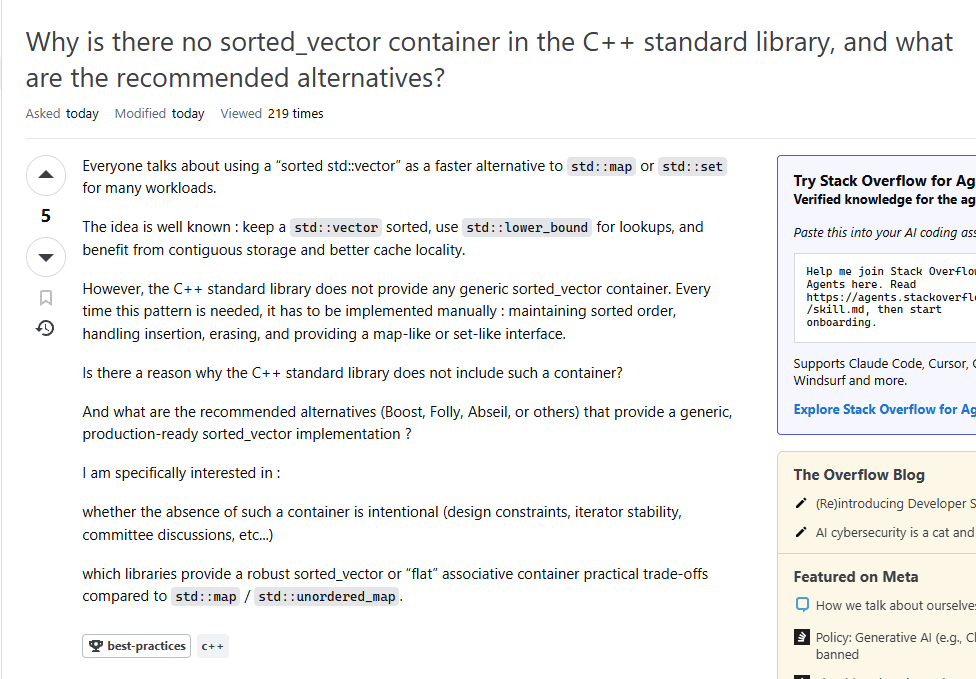

*Learn the Smart Way with Smart Questions*

## Dumb Questions Dumb Answers
Asking questions is the age old, tried and tested way of learning. Teachers often say, "don't be afraid to ask questions" or, "there are no such things as dumb questions", which can be true. Except, they should come with a caveat. The phrase "there are no such things as dumb questions" should also be accompanied by "unless you want good answers". I'm sure there are many times you have witnessed this in your own classrooms, where classmates ask vague questions that is almost hard to not answer with a generalized statement. This not only wastes the time of whoever is answering the question, but also the person asking it as they don't get a meaningful response.

This dilemma is the premise of "How to Ask Questions The Smart Way" by Eric Steven Raymond, in which he describes ways to better post questions to web forums like stack overflow to hopefully receive better answers with less time wasted. Raymond proposes different strategies to help in this endeavor: subject headers should be specific, correct grammar and formatting is used, information on the problem should be clear and precise, and to try and make it as easy as it is to get a answer to you. All of these points are rather common courtesy to whoever is trying to answer your problem. Most of it boils down to: try and make the question being posed as clear and easy to understand as possible for readers. But, what about more coding specific questions? Raymond also covers that in their article. Some of the points like not copy and pasting large volumes of code and asking people to debug code without stating and initial problem or goal can be quite common in web forums. Raymond offers three reasons as to why you might want to follow these points: one, trimming down the code to be more specific can ensure you get an actual answer, two, the answer you get is actually useful for your problem, and three, in narrowing down the scope of your question you might find a solution yourself.

## A Good Example

<a href="https://stackoverflow.com/questions/80002149/why-is-there-no-sorted-vector-container-in-the-c-standard-library-and-what-ar" target="_blank">Stack Overflow

In this example, the question being asked does not contain any code, but is rather asking for advice on the best practice for achieving a sorted vector in C++. The sub header is pretty specific, posing two questions that relate to each other and are easy to understand. The section describing the question proposed in the sub header are all grammatically formatted, and the breaks in between some lines allows for someone to easily read through the whole post. At the end of the post, not only does it reiterate the question, but narrows it down a bit further to whether not having a sorted_vector container in C++ is intentional, and what libraries are good for providing one.
