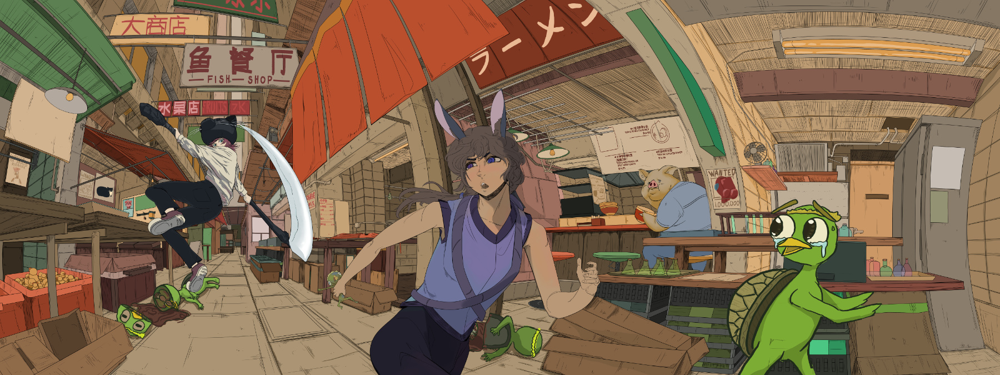

## Description

Crazy Alley was group art project with 2 other classmates. The goal was to combine all of our different style into one piece that would then be displayed and critiqued by peers. There are three characters, a women with a cat mask wielding a scythe, a bunny women, and multiple variants of a Kappa. Our group's concept, The cat women is actively hunting down the Kappas that are loose in the city due to the bunny women freeing them. The setting was inspired by various places, including Hong Kong, Japan, and Honolulu.

## About the Process
Within my group, I managed multiple project files and brought together each one into a cohesive piece. I would also be in charge of drawing the background and a character along with helping other groupmates if they needed. Our group would also decide on swapping each other's characters to draw in our own style.

The final piece was digitally printed using archival pigment print on 25" x 100" archival paper.
