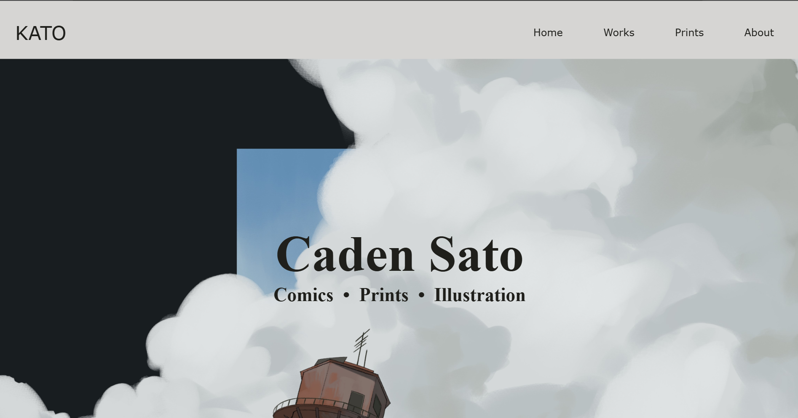

katoprint is a website I solo developed as a portfolio for my artworks and artist resume and CV. Although it is not website with an actual domain yet as I am working to improve and update the code behind it. Currently, a majority of the website is coded using HTML and CSS, but I am working on including more Javascript.

I started this project during my track to complete my BFA degree as a requirement for a class. I had not previously used HTML and CSS, but decided that it would be cool to learn the two languages along the way. 

<a href="https://katoprint.github.io" target="_blank">katoprint website 
<a href="https://github.com/katoprint/katoprint.github.io" target="_blank">github
