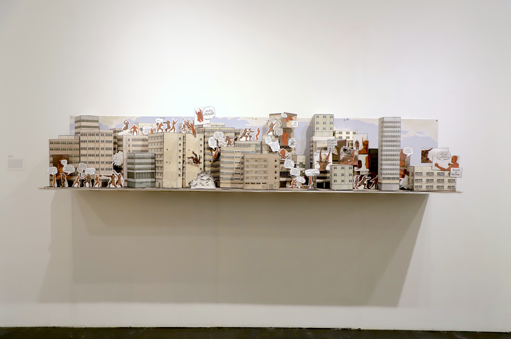

## Description

The Devil in a Suit tells the story of Blank. In a world where a demon’s success is measured in physical strength, Blank is born frail and missing an arm. Instead of conforming to the ideals of her demon kin, she carves her own path inventing a mechanical suit to account for her lack of power. The setting is a dull, monotonous city transformed from a two dimensional comic format into a three dimensional sculpture form. Amongst the streets and tops of the city, Blank and her father battle one another in an effort to assert their ideals. The father,  who believes in convention, against his child wishes to prove themselves capable through their own unique way. This fight represents the struggle between the old and the new. Between societal norms, and personal wishes. 

The work itself is made out of 300IB Magnani Pescia that is digitally printed on and held together with archival paste. The influences of this piece calls back to my interests with comics and manga by including 2D panels and characters.

## About the Process

During the making of The Devil in a Suit I had complete freedom over how I created the piece, how I sourced my materials, and communicating with gallery hands. No prompts or external help was given with the idea or creation process of the artwork with the exception of tri-weekly critiques with my advisor and other peers. As little guidance was given besides a list of deadlines, it was the responsibility of all students within the BFA class to keep in contact with the people working in the gallery. This would include updating them to any changes to how the artwork would look, how we wanted to install, and any logistical limits when it came to install.
